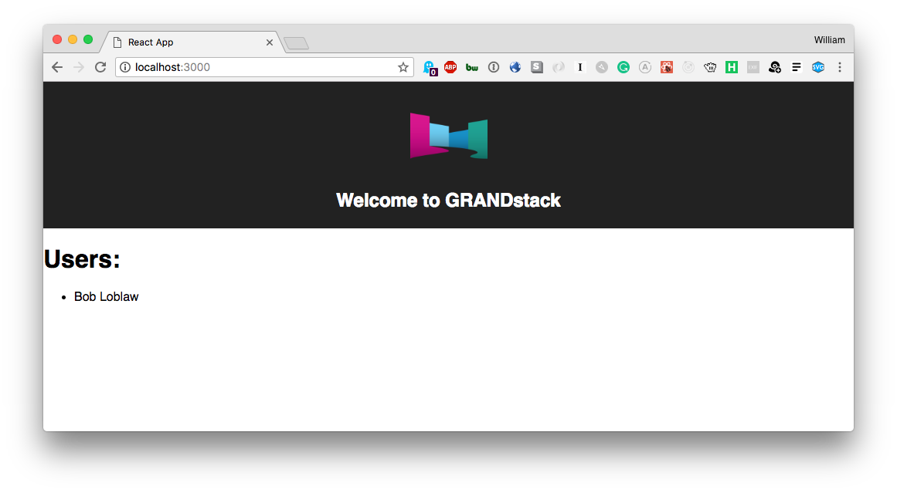

# Blackbook

Built off of the [grand-stack-starter](https://github.com/grand-stack/grand-stack-starter) repo, a CRM organized by relationships.`

## Quickstart

*Install dependencies*

```
(cd ./ui && npm install)
(cd ./api && npm install)
```

*Start API server*
```
cd ./api && npm start
```

This will start the GraphQL API in the foreground, so in another terminal session start the UI development server:

*Start UI server*
```
cd ./ui && npm start
```

## [`/api`](./api)


## [`/ui`](./ui)
